# Architecture

How the Open Box Ventures LLP Panel (`panel.openboxventures.in`) is built and how each portal works.
Diagrams are [Mermaid](https://mermaid.js.org/) and render on GitHub / VS Code.

## 1. System overview

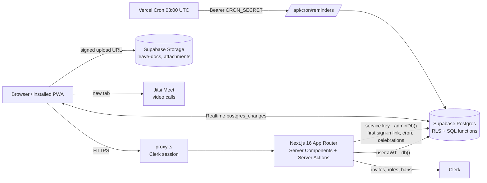

| Layer | Where | Job |
|---|---|---|
| Session | `proxy.ts` | Clerk session + strict CSP (per-request script nonce); no access decisions |
| Who am I | `lib/me.ts` | `getMe()` links Clerk user → `employees` row; page guards `employeePage / staffPage / hrPage / adminPage`; action guards `requireMe / requireStaff / requireAdmin` (+ per-employee rate limit, `rateLimit()`) |
| Data rules | `supabase/schema.sql` | RLS on every table; business rules in `security definer` functions (check-in geofence, leave balance, approvals, payroll) so they can't be bypassed via the API |
| Live UI | `components/live-refresh.tsx` | Any change to a published table the user can read → `router.refresh()` |
| Schema reset | `supabase/reset.sql` | Drops everything; then run `schema.sql` |

Access is checked twice: the TS guard (UX, redirects) and RLS / SQL functions (the real gate).

## 2. Roles and portals

Role lives in Clerk `publicMetadata.role`, carried in the JWT as `metadata.role` (read in SQL by `my_role()`).

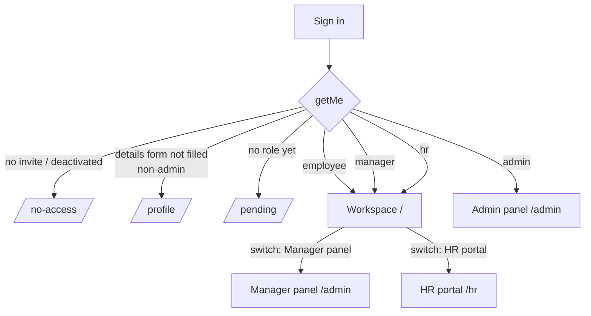

| Role | Portals | Scope |
|---|---|---|
| `employee` | Workspace | Self |
| `manager` | Workspace + Manager panel (`/admin`) | Own department in own office (`manages()`), first-step leave approval for employees |
| `branch_head` | Workspace + Manager panel (`/admin`) | All departments in own office, first-step leave approval for employees and managers |
| `hr` | Workspace + HR portal (`/hr`) | Own office: final leave approval, regularizations, payroll prep |
| `admin` | Admin panel (`/admin`) only | Whole org; no attendance/leave of their own |

`manages(emp)` = admin, branch head/HR in the same `office_id`, or manager in the same `office_id` + `department_id` (never yourself).

## 3. Workspace (`/`) — every non-admin

| Page | What |
|---|---|
| `/` Dashboard | Check-in card, reminders (to-dos due, birthdays, anniversaries, next holiday) |
| `/todos` | Personal list + tasks assigned by managers/HR/admin |
| `/attendance` | History, monthly stats, **regularization** requests |
| `/leave` | Balances, apply, cancel, add/replace document |
| `/chat` | DMs, groups, department channels, Announcements |
| `/directory`, `/org` | Colleagues, org chart |
| `/profile` | Personal details, bank details, my salary |
| `/support` | Report an issue to admins |

### Daily attendance

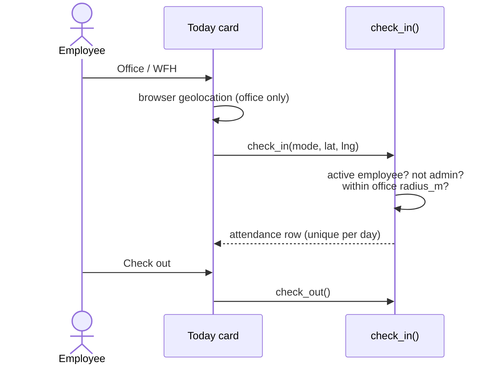

`attendance_report` view adds `late` (after `work_start + grace_min`), `early_leave`, `hours`.

### Regularization (missed / wrong check-in)

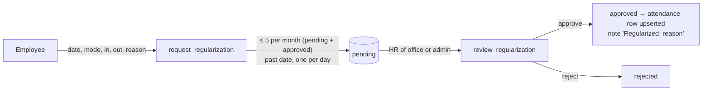

### Leave (two-step approval)

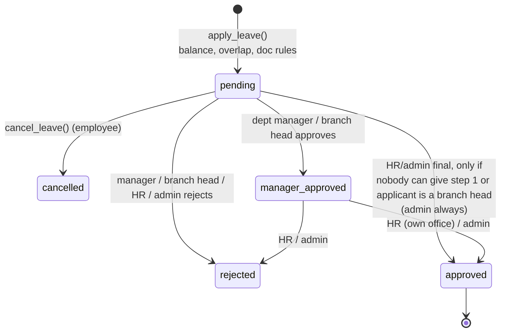

- All reviews go through `review_leave()`; direct updates are revoked.
- HR's own leave → admin only. Nobody reviews their own.
- `leave_balances`: `manager_approved` counts as pending, not used.
- Documents: upload to `leave-docs` via signed URL; `update_leave_doc()` attaches/replaces on pending / manager-approved / approved requests. Downloads via `/files/leave/[id]` (RLS lookup → short-lived signed URL).

### Chat

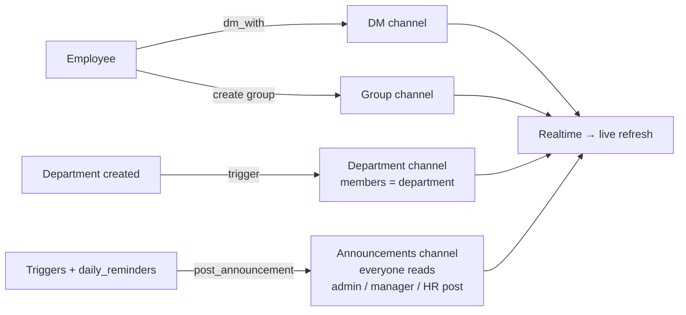

Admins are not chat members (use Report an issue). Video call = Jitsi room named after the channel id.

## 4. Manager panel (`/admin`, role `manager`)

Overview · To-do · Employees (own office, read-only) · Org chart · Attendance (fix entries, see regularizations as "Waiting for HR") · Leave (first-step approval) · Announcements.

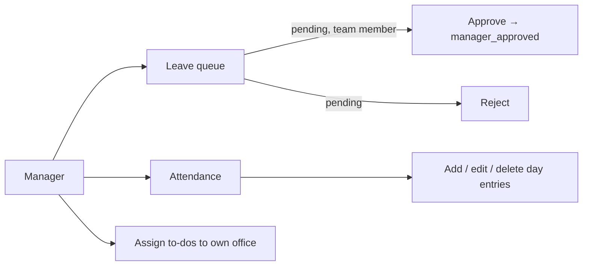

## 5. HR portal (`/hr`, role `hr`)

`app/hr/*` re-exports the admin pages, so logic lives once; RLS scopes everything to HR's office.

| Page | What |
|---|---|
| `/hr` Overview | Headcount, joiners this month, exits in 30 days, open leave, pending regularizations, today's present / on leave / not in |
| `/hr/leave` | Final approval, with balance, leave taken this year, manager's note |
| `/hr/attendance` | Day view + approve/reject regularizations |
| `/hr/payroll` | Salaries, increments, bank details, build & submit salary sheets |
| `/hr/employees`, `/hr/org` | Office employees (All / Active / Deactivated), org chart |
| `/hr/todos`, `/hr/announcements` | Assign tasks, post announcements |

Nav badges (Leave, Attendance) come from `lib/pending.ts → pendingCounts()`.

### Payroll (India CTC) — HR prepares, admin approves

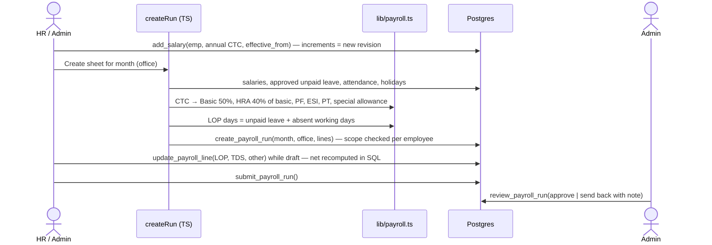

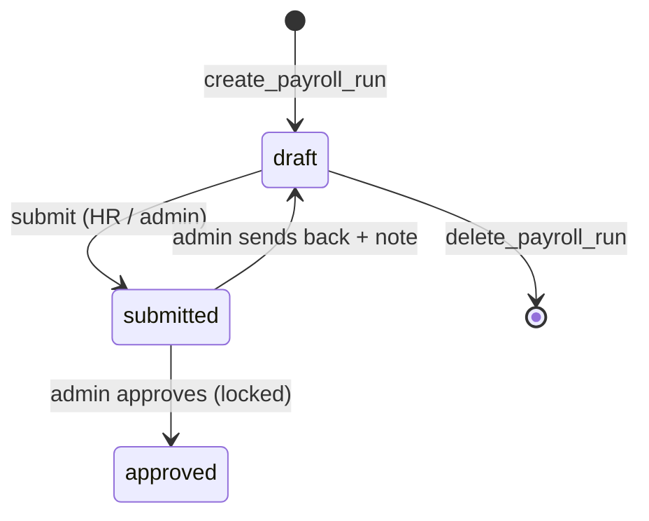

Salary and bank rows are visible to the employee, admin, and HR of the employee's office only — never managers or colleagues (`can_see_pay()`). CSV export: `/hr/payroll/[id]/export`.

## 6. Admin panel (`/admin`, role `admin`)

Everything managers see, org-wide, plus: Offices (geofence, hours, work days) · Departments · Employees (invite, role, code, alias, company mobile, joined/exit date, reports to, deactivate) · Leave policy & holidays (incl. CSV import) · Payroll approval · Issues.

### Invite → active employee

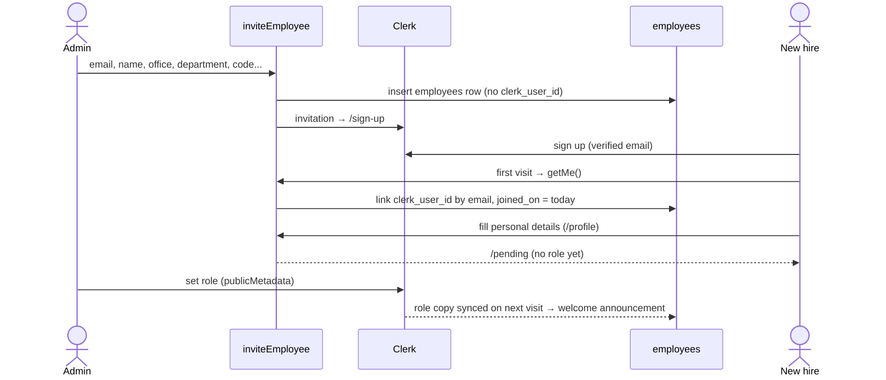

Deactivate = `employees.active = false` (RLS cuts access) + Clerk ban.

### Org chart

`employees.reports_to` (set by admin) → tree in `components/org-chart.tsx`. A trigger blocks cycles; roots = people without an active manager; no reporting lines at all → grouped by department.

## 7. Automations

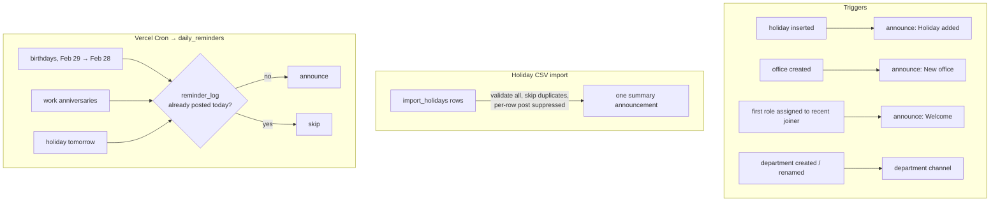

UI reminders (no notification table): Workspace dashboard card, admin "Needs attention" (approvals waiting > 24h), nav count badges.

## 8. Data model

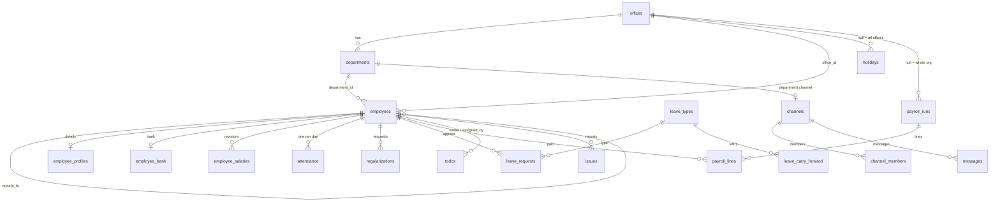

## 9. Security notes

- Every table has RLS; writes for leave, regularizations and payroll only via `security definer` functions (direct `update` revoked).
- `post_announcement`, `orphan_uploads`, `daily_reminders`, `hit_rate_limit` are not callable through the API.
- Uploads: browser → signed URL (10 MB bucket cap, MIME allowlist: images, video, PDF, Office, text/CSV, zip; no HTML/SVG); a path is only accepted if it starts with your employee id. Downloads are forced except images/videos (`?view`).
- Rate limit: `requireMe()` (every server action, `/files`, CSV exports) and the profile actions call `hit_rate_limit`: 120 per employee per minute, fixed window in `rate_limits`. Over the limit the action throws; `ActionForm` shows a "too many requests" message. IP-level limits: Vercel Firewall.
- CSP (`proxy.ts`, Clerk `contentSecurityPolicy.strict`): scripts only with the per-request nonce (`'strict-dynamic'`), so injected markup can't run script; connections/images limited to self, Clerk and the Supabase project; `frame-ancestors 'none'`. Other headers (HSTS, nosniff, referrer, permissions) in `next.config.ts`.
- Injection: queries go through supabase-js / RPC parameters, no SQL built from strings; free-text search strips PostgREST filter syntax; CSV exports neutralise spreadsheet formulas. Free-text columns have length caps in the schema.
- Cron route rejects requests unless `Authorization: Bearer $CRON_SECRET` matches (and refuses if the secret is unset).
- SEO: only `/sign-in` is indexable; production canonical origin is always `https://panel.openboxventures.in`.
- Tests: `npm run test:rls` runs `reset.sql → schema.sql` twice in PGlite and asserts the access rules; `node lib/payroll.check.mjs` checks the calculator.
